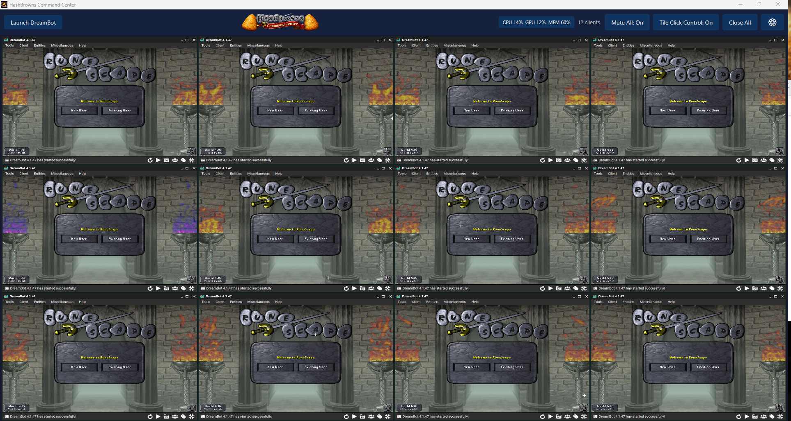
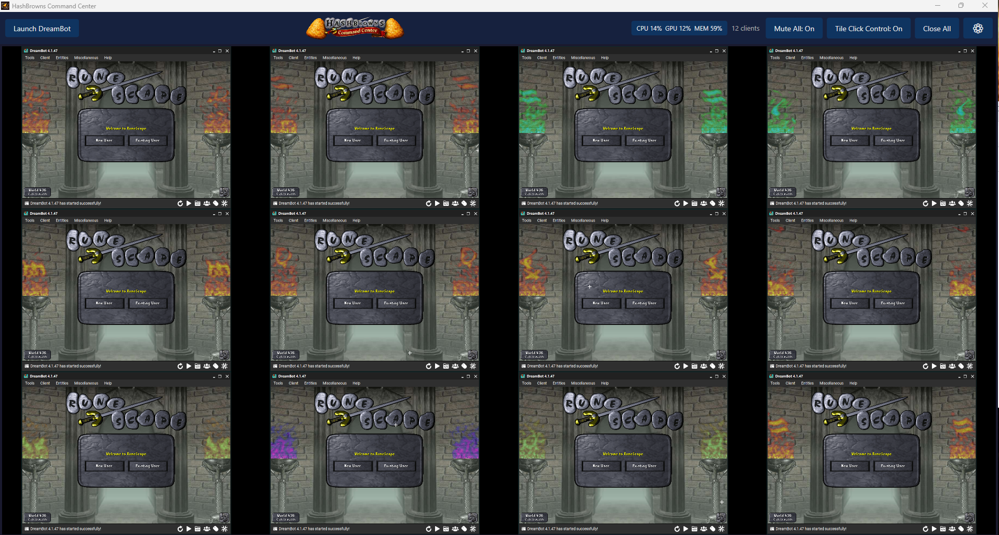
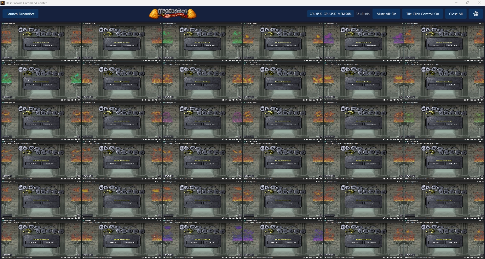
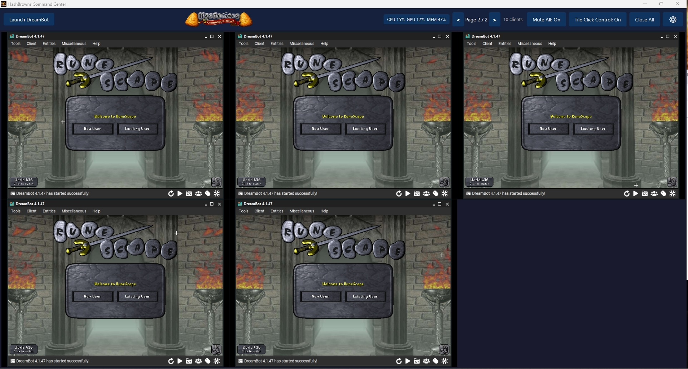
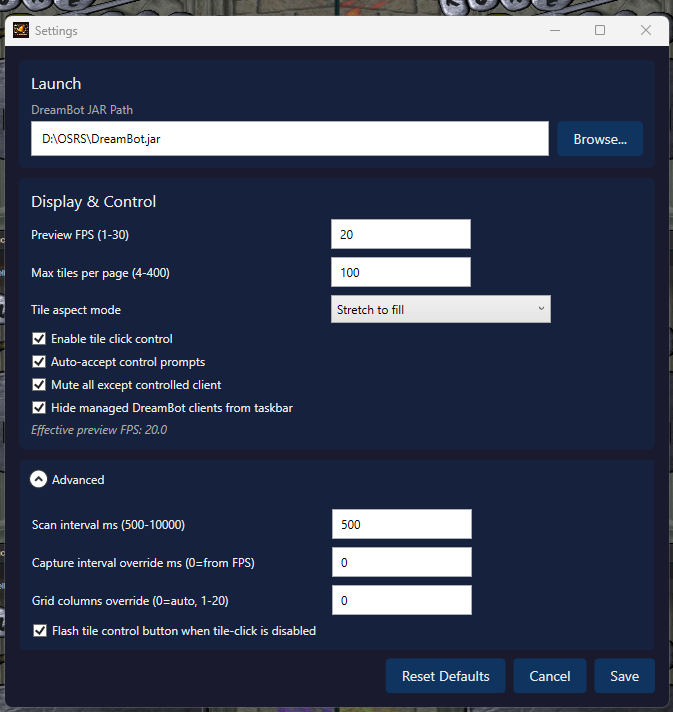

# HashBrowns Command Center


HashBrowns Command Center is a multi-client DreamBot organizer / manager that lets you run and manage a lot of clients in one clean dashboard without everything turning into a mess.

## What it can do

- Organize lots of clients in one window (20+ supported)
- Scale tiles so they stay usable at high client counts
- Quick client control flow
- Right-click tile actions (Mute/Unmute client, Close client)
- Top-bar controls for Mute All, Tile Click Control, Close All
- Settings menu for FPS/layout/performance

## Main Features

- Scalable grid layout for large multi-client sessions
- Click-to-control workflow with optional prompts
- Per-client and global audio controls
- Startup setup prompt if DreamBot JAR path is not configured
- Full source code included for transparency

## Quick Start (For Most Users)

1. Download this repo as ZIP and extract it.
2. Open the extracted folder.
3. Run:

```powershell
powershell -ExecutionPolicy Bypass -File .\Build-Portable.ps1
```

4. After build finishes, open this folder:

`HashBrowns-Command-Center`

5. Run this file:

`HashBrowns Command Center.exe`

This is the main app exe and is intentionally named `HashBrowns Command Center.exe` (not `ClientDashboard.exe`).

## Screenshots

### Dashboard Overview


### Keep Default Ratio Mode


### High Client Count


### Second Page View


### Settings


## Projects

- `ClientDashboard/` - Main WPF app source code

`AutoTest` and `OneClick-LiveDreamBotTest.ps1` are not required for normal users and are not included in this repo.

## Requirements

- Windows 10/11
- .NET 8 SDK (for building from source)

## Build

```powershell
dotnet build ClientDashboard/ClientDashboard.csproj
```

## Run (dev)

```powershell
dotnet run --project ClientDashboard/ClientDashboard.csproj
```

## Publish

```powershell
dotnet publish ClientDashboard/ClientDashboard.csproj -c Release -o ClientDashboard/publish
```

## Where the EXE is

- If you used `Build-Portable.ps1`, the exe is here:
  - `HashBrowns-Command-Center\HashBrowns Command Center.exe`
- If you used `dotnet publish` manually, the exe is in whatever output folder you passed with `-o`.
